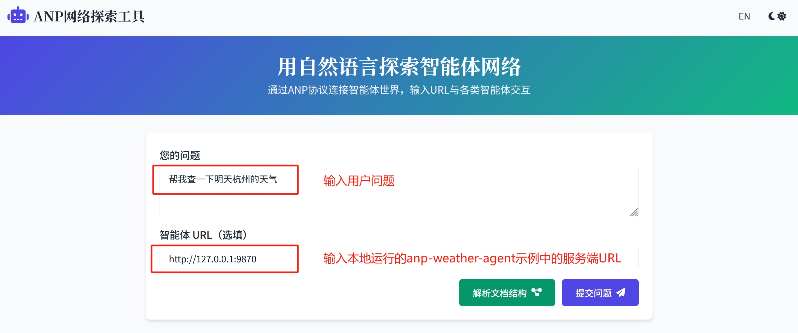
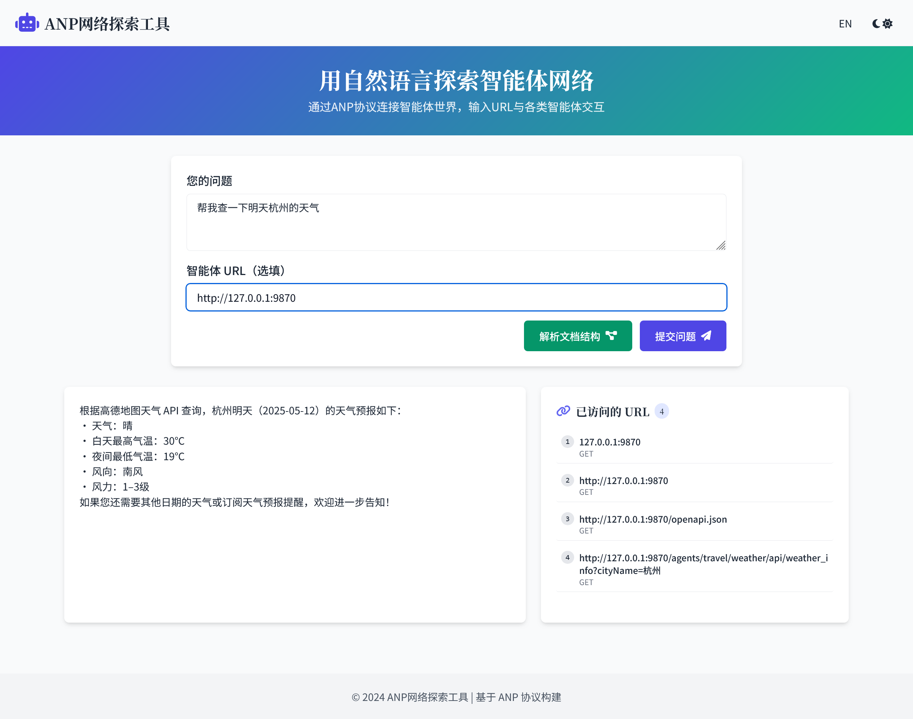

# ANP天气智能体服务 (服务端) / ANP Weather Agent Service (Server)

[English](#english) | [中文](#chinese)

<a name="chinese"></a>
## 中文文档

### 项目介绍

天气智能体服务是一个**完全支持ANP协议的智能体服务**，基于FastAPI构建，专门提供天气信息查询服务。该服务通过高德地图天气API获取全国城市的天气数据，并提供符合ANP规范的API接口，使任何支持ANP的智能体都能轻松访问天气信息。服务实现了DID身份验证，确保API访问的安全性。

主要功能包括：
- 天气信息查询：让其他智能体能够通过ANP协议获取详细的天气预报信息
- 智能体描述：提供符合ANP协议的智能体描述信息(ad.json)，便于服务发现
- 天气信息订阅：支持其他智能体订阅天气信息服务（功能开发中）
- 自然语言接口：计划支持自然语言查询天气信息（功能开发中）

### 项目结构

本项目包含以下主要组件：

- **anp_weather_agent.py/**                  # 应用主入口
- **config.py/**                             # 配置文件
- **api_router/**                            # API路由定义
   - **router.py/**                          # 主路由注册
   - **did_auth_middleware.py/**             # DID认证中间件
   - **jwt_config.py/**                      # JWT配置
   - **weather/**                            # 天气相关API
      - **ad_router.py/**                    # 智能体描述API
      - **nl_router.py/**                    # 自然语言查询API
      - **subscription_router.py/**          # 订阅服务API
      - **weather_info_router.py/**          # 天气信息API
      - **yaml_router.py/**                  # YAML文件API
      - **api/**                             # YAML接口描述文件目录
- **doc/**                                   # 文档和密钥
   - **test_jwt_key/**                       # 测试JWT密钥
   - **use_did_test_public//**               # DID测试文档
- **utils/**                                 # 工具类
   - **log_base.py/**                        # 日志配置
- **scripts/**                               # 测试脚本
   - **test_weather_agent_auth.py/**         # DID认证测试脚本
   - **test_weather_agent_discovery.py/**    # 智能体发现测试脚本   

### 如何运行（面向体验用户）

#### 环境设置

在运行项目之前，你需要设置必要的环境变量。项目中提供了一个 `.env.example` 文件作为模板：

1.  复制 `.env.example` 文件并重命名为 `.env`：
   ```bash
   cp .env.example .env
   ```
2.  编辑 `.env` 文件，填入你的实际配置信息。
   ```
   # 天气服务设置
   # 默认高德的API，你也可以换成其他的API
      AMAP_WEATHER_API_URL = "https://restapi.amap.com/v3/weather/weatherInfo"
      AMAP_API_KEY = "your-amap-api-key"

   # 你的agent描述json文件的域名，你的子URL需要使用到这个配置
   # 如果本地运行，可以使用localhost:9870，其中9870是端口号
      AGENT_DESCRIPTION_JSON_DOMAIN = "localhost:9870"

   # JWT设置
   # 私钥和公钥文件，用于生成和验证JWT token
   # 请不要在生产环境中使用这些测试密钥，这些文件仅用于测试
      JWT_PRIVATE_KEY_PATH = "doc/test_jwt_key/private_key.pem"
      JWT_PUBLIC_KEY_PATH = "doc/test_jwt_key/public_key.pem"

   # DID设置
   # 你的DID的域名，以下配置仅用于测试，请不要在生产环境中使用
      DID_DOMAIN = "agent-did.com"
      DID_PATH = "test:public"
   ```
#### 使用Web应用程序

通过以下步骤，你可以在本地运行Web应用程序。

1. 安装依赖：
   ```bash
   # 使用Poetry
   poetry install
   
   # 或使用pip
   pip install -r requirements.txt
   ```

2. 启动ANP天气智能体服务（服务端）：
   
   运行代码：
   ```bash
   python /anp-weather-agent/anp_weather_agent.py
   ```

3. 启动ANP explorer 工具测试ANP天气智能体

   以下代码位于anp-examples项目：

   方式一：运行脚本
   ```bash
   # 使用Poetry
   ./web_app/run_with_poetry.sh
   
   # 或使用脚本
   ./web_app/run.sh
   ```
   方式二：运行代码
   ```bash
   python /anp-examples/web_app/backend/anp_examples_backend.py
   ```

4. 打开浏览器访问：`http://localhost:5000`

5. 在输入框中输入您的问题，并提供智能体URL（`https://127.0.0.1：9870`）


6. 点击"提交问题"按钮，查看结果和网络爬取过程


### 如何开发（面向开发者）

1. 克隆仓库：
   ```bash
   git clone git@github.com:agent-network-protocol/anp-weather-agent.git
   cd anp-weather-agent
   ```
2. 安装开发依赖：
   ```bash
   # 使用Poetry
   poetry install
   
   # 或使用pip
   pip install -r requirements.txt
   ```

3. 运行测试：
   ```bash
   python /anp-weather-agent/anp_weather_agent.py
   ```

4. 观察日志：


---

<a name="english"></a>
## English Documentation

### Project Introduction

The weather intelligent agent service is a **fully supported ANP protocol intelligent agent service**, built on FastAPI, specifically providing weather information query services.
This service obtains weather data for cities across the country through the Amap Weather API and provides API interfaces that comply with ANP standards, making it easy for any intelligent agent that supports ANP to access weather information.The service implements DID authentication to ensure the security of API access.

### Project Structure

This project contains the following main components:

- **anp_weather_agent.py/**                  # Application main entrance
- **config.py/**                             # configuration file
- **api_router/**                            # API Routing Definition
   - **router.py/**                          # Main route registration
   - **did_auth_middleware.py/**             # DID authentication middleware
   - **jwt_config.py/**                      # JWT configuration
   - **weather/**                            # Weather related APIs
      - **ad_router.py/**                    # Intelligent Agent Description API
      - **nl_router.py/**                    # Natural Language Query API
      - **subscription_router.py/**          # Subscription Service API
      - **weather_info_router.py/**          # Weather Information API
      - **yaml_router.py/**                  # YAML file API
      - **api/**                             # YAML interface description file 
- **doc/**                                   # Documents and keys
   - **test_jwt_key/**                       # Test JWT key
   - **use_did_test_public//**               # DID Testing Document
- **utils/**                                 # Tool category
   - **log_base.py/**                        # Log Configuration
- **scripts/**                               # Test Script
   - **test_weather_agent_auth.py/**         # DID Authentication test script
   - **test_weather_agent_discovery.py/**    # Agent discovery test script   

### How to run (for experiential users)

#### Environment Setup

Before running the project, you need to set up the necessary environment variables. An `.env.example` file is provided as a template:

1.  Copy the `.env.example` file and rename it to `.env`:
   ```bash
   cp .env.example .env
   ```
2.  Edit the `.env` file and fill in your actual configuration information.
   ```
   # Weather service settings
   # Default Gaode API, you can also switch to other APIs
   AMAP_WEATHER_API_URL = " https://restapi.amap.com/v3/weather/weatherInfo "
   AMAP_API_KEY = "your-amap-api-key"

   # Your agent describes the domain name of the JSON file, and your sub URL needs to use this configuration
   # f running locally, you can use localhost: 9870, where 9870 is the port number
   AGENT_DESCRIPTION_JSON_DOMAIN = "localhost:9870"

   # JWT settings
   # Private and public key files used for generating and verifying JWT tokens
   # Please do not use these test keys in the production environment, these files are only for testing purposes
   JWT_PRIVATE_KEY_PATH = "doc/test_jwt_key/private_key.pem"
   JWT_PUBLIC_KEY_PATH = "doc/test_jwt_key/public_key.pem"

   # DID settings
   # Your DID domain name, the following configuration is only for testing purposes, please do not use it in production environments
   DID_DOMAIN = "agent-did.com"
   DID_PATH = "test:public"
   ```

#### Using the Web Application

By following these steps, you can run a web application locally.

1. Install dependencies:
   ```bash
   # Using Poetry
   poetry install
   
   # Or using pip
   pip install -r requirements.txt
   ```

2. Start ANP weather intelligent agent service (server):
   ```bash
   python /anp-weather-agent/anp_weather_agent.py
   ```

3. Launch ANP explorer tool to test ANP weather agent
   The following code is located in the anp-examples project:
   Mode A：Run the script
   ```bash
   # Using Poetry
   ./web_app/run_with_poetry.sh
   
   # Or use scripts
   ./web_app/run.sh
   ```
   Mode B：Run the code
   ```bash
   python /anp-examples/web_app/backend/anp_examples_backend.py
   ```

4. Open browser and visit:`http://localhost:5000`

5. Enter your question in the input box and provide an agent URL（`https://127.0.0.1：9870`）


6. Click the "Submit" button，and view results and the network crawling process


### How to Develop (for Developers)

1. Clone the repository:
   ```bash
   git clone git@github.com:agent-network-protocol/anp-weather-agent.git
   cd anp-weather-agent
   ```
2. Install development dependencies:
   ```bash
   # Using Poetry
   poetry install
   
   # or Use pip
   pip install -r requirements.txt
   ```

3. Run tests:
   ```bash
   python /anp-weather-agent/anp_weather_agent.py
   ```

4.  Observe logs:

