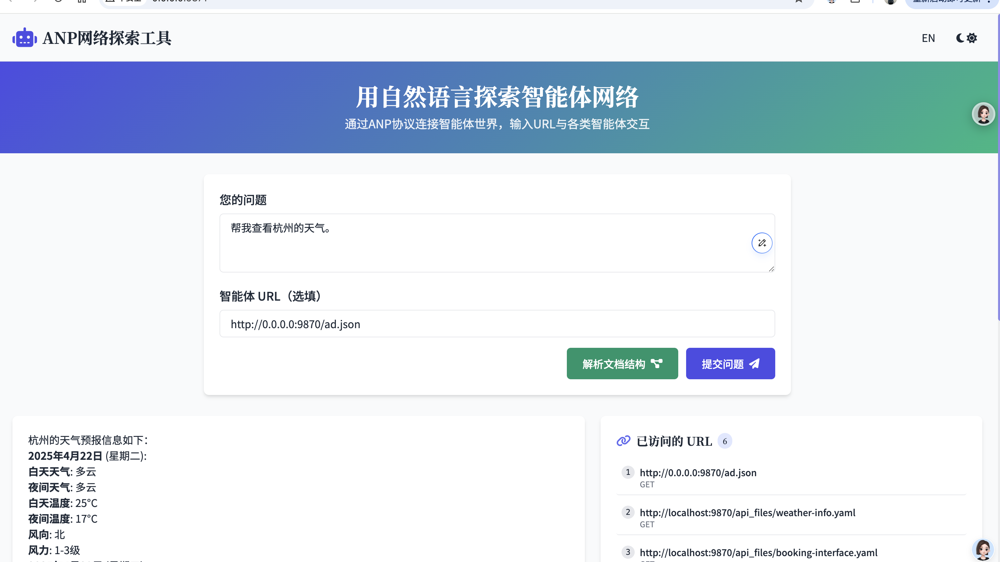

# ANP Weather Agent Service

[English](README.md) | [中文](README.cn.md)

## 1. Code Functionality

The Weather Agent Service is a **fully ANP protocol-compliant agent** built on FastAPI, specifically designed to provide weather information query services. This service obtains weather data for cities across China through the Amap (AutoNavi) Weather API and provides API interfaces that conform to ANP specifications, allowing any agent supporting ANP to easily access weather information. The service implements DID identity verification to ensure API access security.

Main features include:
- Weather information query: Allows other agents to obtain detailed weather forecast information through the ANP protocol
- Agent description: Provides ANP protocol-compliant agent description information (ad.json) for service discovery
- Weather information subscription: Supports other agents subscribing to weather information services (feature in development)
- Natural language interface: Plans to support natural language queries for weather information (feature in development)

## 2. ANP Agent Interaction Process

Any agent supporting ANP can interact with the Weather Agent through the ANP protocol and query weather information. The typical interaction flow is as follows:

1. **Service Discovery**: The client agent obtains the Weather Agent's description file (ad.json)
   - Under default configuration, the ad.json path is: `http://0.0.0.0:9870/ad.json`

2. **Identity Authentication**: The client agent uses the private key corresponding to its DID to sign and send HTTPS requests to obtain the complete ad.json

3. **Service Invocation**: Based on the Interface definitions in ad.json, the client agent calls the relevant weather services
   - Can obtain current weather information
   - Can obtain weather forecast information
   - Can subscribe to weather change notifications (whitelist users)

### ANP Agent Interaction Flow Diagram

```
┌─────────────────┐                     ┌─────────────────┐
│                 │                     │                 │
│  Client Agent   │                     │  Weather Agent  │
│                 │                     │                 │
└────────┬────────┘                     └────────┬────────┘
         │                                       │
         │  1. Request agent description file    │
         │  GET /ad.json                         │
         │───────────────────────────────────────▶
         │                                       │
         │  2. Return agent description          │
         │                                       │
         │◀───────────────────────────────────────
         │                                       │
         │  3. Use DID signature                 │
         │  Request weather service              │
         │  POST /v1/weather/info                │
         │───────────────────────────────────────▶
         │                                       │
         │  4. Verify DID identity               │
         │  Return weather data                  │
         │                                       │
         │◀───────────────────────────────────────
         │                                       │
┌────────┴────────┐                     ┌────────┴────────┐
│                 │                     │                 │
│  Client Agent   │                     │  Weather Agent  │
│                 │                     │                 │
└─────────────────┘                     └─────────────────┘
```

## 2. Directory Structure

```
anp-weather-agent/
├── anp_weather_agent.py      # Application main entry
├── config.py                 # Configuration file
├── api_router/               # API route definitions
│   ├── __init__.py
│   ├── router.py             # Main route registration
│   ├── did_auth_middleware.py # DID authentication middleware
│   ├── jwt_config.py         # JWT configuration
│   └── weather/              # Weather-related APIs
│       ├── __init__.py
│       ├── ad_router.py      # Agent description API
│       ├── nl_router.py      # Natural language query API
│       ├── subscription_router.py # Subscription service API
│       ├── weather_info_router.py # Weather information API
│       ├── yaml_router.py    # YAML file API
│       └── api/              # YAML interface description file directory
├── doc/                      # Documentation and keys
│   ├── test_jwt_key/         # Test JWT keys
│   └── use_did_test_public/  # DID test documents
├── utils/                    # Utility classes
│   ├── __init__.py
│   └── log_base.py           # Log configuration
└── scripts/                  # Test scripts
    ├── test_weather_agent_auth.py
    └── test_weather_agent_discovery.py
```

## 3. Installation and Configuration

### Requirements
- Python 3.8+
- FastAPI
- Uvicorn
- aiohttp
- Poetry (dependency management tool)

### Installation Steps

1. Clone the repository
```bash
git clone git@github.com:agent-network-protocol/anp-weather-agent.git
cd anp-weather-agent
```

2. Install dependencies with Poetry
```bash
# If Poetry is not installed, you can install it with the following command
# curl -sSL https://install.python-poetry.org | python3 -

# Install dependencies
poetry install

# Activate Poetry virtual environment
poetry shell
```

### Configuration Instructions

1. Create a `.env` file, referring to `.env.example` for configuration:
```
# Weather service settings
# Default Amap API, you can also use other APIs
AMAP_WEATHER_API_URL = "https://restapi.amap.com/v3/weather/weatherInfo"
AMAP_API_KEY = "your-amap-api-key"

# Domain for your agent description json file, your sub-URLs will need this configuration
# If running locally, you can use localhost:9870, where 9870 is the port number
AGENT_DESCRIPTION_JSON_DOMAIN = "localhost:9870"

# JWT settings
# Private and public key files, used to generate and verify JWT tokens
# Please do not use these test keys in a production environment, these files are for testing only
JWT_PRIVATE_KEY_PATH = "doc/test_jwt_key/private_key.pem"
JWT_PUBLIC_KEY_PATH = "doc/test_jwt_key/public_key.pem"

# DID settings
# Your DID domain, the following configuration is for testing only, please do not use in a production environment
DID_DOMAIN = "agent-did.com"
DID_PATH = "test:public"
```

2. Obtain Amap API key
   - Visit [Amap Open Platform](https://lbs.amap.com/) to register an account
   - Create an application and enable the weather API service
   - Get the API Key and configure it in the `.env` file

Note: If you need to use other weather information providers, you need to modify the relevant code in the `api_router/weather/weather_info_router.py` file to connect to the corresponding API interfaces.

### Starting the Service

```bash
# Ensure you are in the Poetry environment
poetry run python anp_weather_agent.py

# Or if you have already activated the Poetry shell
python anp_weather_agent.py
```

The service runs on `http://localhost:9870` by default.

### Testing the Weather Agent with ANP Explorer

1. Download and install [ANP explorer], code path: git@github.com:agent-network-protocol/anp-examples.git

2. Install and run according to the anp-examples project's readme, and open the page: http://0.0.0.0:9871/

3. Enter http://0.0.0.0:9870/ad.json in the page to access this weather agent's description information


