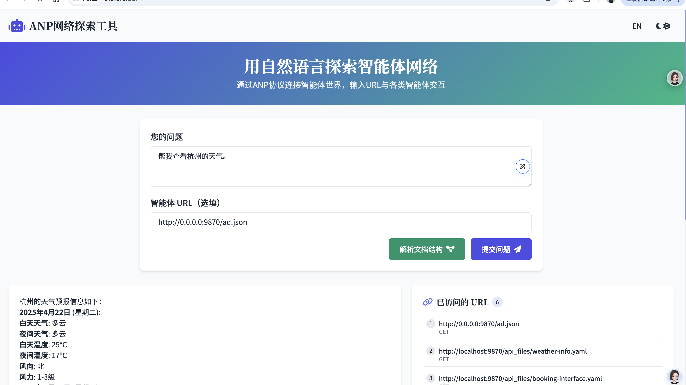

# ANP天气智能体服务

## 1. 代码功能

天气智能体服务是一个**完全支持ANP协议的智能体**，基于FastAPI构建，专门提供天气信息查询服务。该服务通过高德地图天气API获取全国城市的天气数据，并提供符合ANP规范的API接口，使任何支持ANP的智能体都能轻松访问天气信息。服务实现了DID身份验证，确保API访问的安全性。

主要功能包括：
- 天气信息查询：让其他智能体能够通过ANP协议获取详细的天气预报信息
- 智能体描述：提供符合ANP协议的智能体描述信息(ad.json)，便于服务发现
- 天气信息订阅：支持其他智能体订阅天气信息服务（功能开发中）
- 自然语言接口：计划支持自然语言查询天气信息（功能开发中）

## 2. ANP智能体交互流程

任何支持ANP的智能体都可以通过ANP协议与天气智能体交互并查询天气信息。典型交互流程如下：

1. **服务发现**：客户端智能体获取天气智能体的描述文件(ad.json)
   - 默认配置下，ad.json路径为：`http://0.0.0.0:9870/ad.json`

2. **身份认证**：客户端智能体使用DID对应的私钥进行签名，发送HTTPS请求获取完整的ad.json

3. **服务调用**：根据ad.json中的Interface定义，客户端智能体调用相关的天气服务
   - 可获取当前天气信息
   - 可获取天气预报信息
   - 可订阅天气变化通知（白名单用户）

### ANP智能体交互流程图

```
┌─────────────────┐                     ┌─────────────────┐
│                 │                     │                 │
│  客户端智能体     │                     │  天气智能体       │
│                 │                     │                 │
└────────┬────────┘                     └────────┬────────┘
         │                                       │
         │  1. 请求智能体描述文件                   │
         │  GET /ad.json                         │
         │───────────────────────────────────────▶
         │                                       │
         │  2. 返回智能体描述                      │
         │                                       │
         │◀───────────────────────────────────────
         │                                       │
         │  3. 使用DID签名                        │
         │  请求天气服务                           │
         │  POST /v1/weather/info                │
         │───────────────────────────────────────▶
         │                                       │
         │  4. 验证DID身份                        │
         │  返回天气数据                           │
         │                                       │
         │◀───────────────────────────────────────
         │                                       │
┌────────┴────────┐                     ┌────────┴────────┐
│                 │                     │                 │
│  客户端智能体     │                     │  天气智能体       │
│                 │                     │                 │
└─────────────────┘                     └─────────────────┘
```

### 关键代码说明

- 函数get_weather_agent_description，获得天气智能体描述文档
- 函数get_weather_info，获得天气信息

## 2. 目录介绍

```
anp-weather-agent/
├── anp_weather_agent.py      # 应用主入口
├── config.py                 # 配置文件
├── api_router/               # API路由定义
│   ├── __init__.py
│   ├── router.py             # 主路由注册
│   ├── did_auth_middleware.py # DID认证中间件
│   ├── jwt_config.py         # JWT配置
│   └── weather/              # 天气相关API
│       ├── __init__.py
│       ├── ad_router.py      # 智能体描述API
│       ├── nl_router.py      # 自然语言查询API
│       ├── subscription_router.py # 订阅服务API
│       ├── weather_info_router.py # 天气信息API
│       ├── yaml_router.py    # YAML文件API
│       └── api/              # YAML接口描述文件目录
├── doc/                      # 文档和密钥
│   ├── test_jwt_key/         # 测试JWT密钥
│   └── use_did_test_public/  # DID测试文档
├── utils/                    # 工具类
│   ├── __init__.py
│   └── log_base.py           # 日志配置
└── scripts/                  # 测试脚本
    ├── test_weather_agent_auth.py
    └── test_weather_agent_discovery.py
```

## 3. 安装与配置

### 环境要求
- Python 3.8+
- FastAPI
- Uvicorn
- aiohttp
- Poetry（依赖管理工具）

### 安装步骤

1. 克隆代码仓库
```bash
git clone git@github.com:agent-network-protocol/anp-weather-agent.git
cd anp-weather-agent
```

2. 使用 Poetry 安装依赖
```bash
# 如果尚未安装 Poetry，可以使用以下命令安装
# curl -sSL https://install.python-poetry.org | python3 -

# 安装依赖
poetry install

# 激活 Poetry 虚拟环境
poetry shell
```

### 配置说明

1. 创建 `.env` 文件，参考 `.env.example` 进行配置：
```
# 天气服务设置
# 默认高德的API，你也可以换成其他的API
AMAP_WEATHER_API_URL = "https://restapi.amap.com/v3/weather/weatherInfo"
AMAP_API_KEY = "your-amap-api-key"

# 你的agent描述json文件的域名，你的子URL需要使用到这个配置
# 如果本地运行，可以使用localhost:9870，其中9870是端口号
AGENT_DESCRIPTION_JSON_DOMAIN = "localhost:9870"

# JWT设置
# 私钥和公钥文件，用于生成和验证JWT token
# 请不要在生产环境中使用这些测试密钥，这些文件仅用于测试
JWT_PRIVATE_KEY_PATH = "doc/test_jwt_key/private_key.pem"
JWT_PUBLIC_KEY_PATH = "doc/test_jwt_key/public_key.pem"

# DID设置
# 你的DID的域名，以下配置仅用于测试，请不要在生产环境中使用
DID_DOMAIN = "agent-did.com"
DID_PATH = "test:public"
```

2. 获取高德地图API密钥
   - 访问[高德开放平台](https://lbs.amap.com/)注册账号
   - 创建应用并启用天气API服务
   - 获取API Key并配置到 `.env` 文件中

注意：如果需要使用其他天气信息供应商，需要修改 `api_router/weather/weather_info_router.py` 文件中的相关代码，对接相应的API接口。

### 启动服务

```bash
# 确保处于 Poetry 环境中
poetry run python anp_weather_agent.py

# 或者如果已经激活了 Poetry shell
python anp_weather_agent.py
```

服务默认在 `http://localhost:9870` 运行。 

### 使用ANP explorer 工具测试天气智能体

1. 下载并安装 [ANP explorer]，代码路径：git@github.com:agent-network-protocol/anp-examples.git

2. 安装anp-examples项目的readme运行，并且打开页面：http://0.0.0.0:9871/

3. 在页面中输入：http://0.0.0.0:9870/ad.json，访问此天气智能体的描述信息




